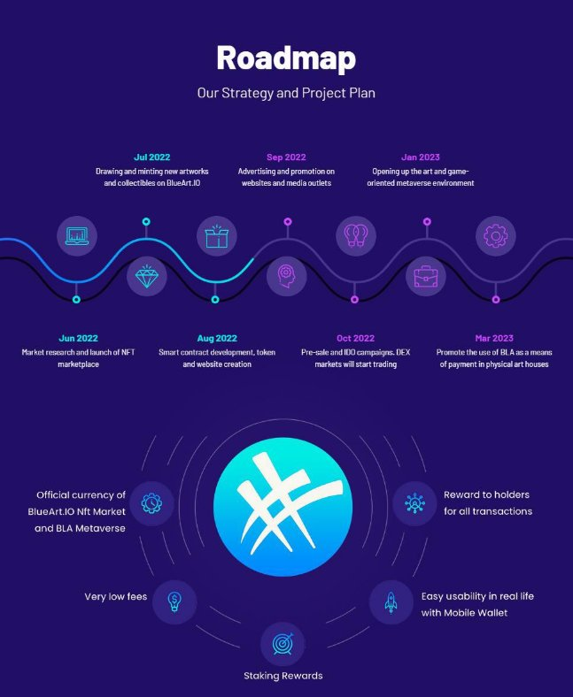
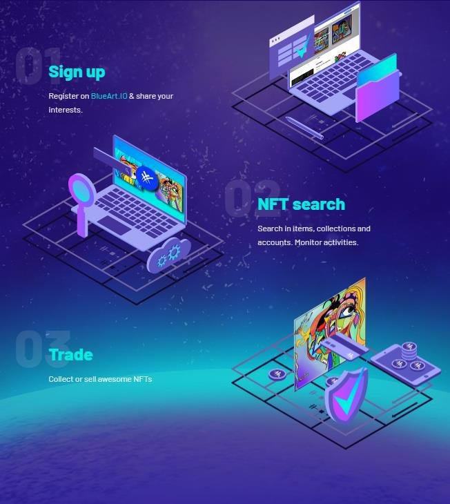

**BlueArt Token (BLA)**  

**Light Paper v1.0** 

Blockchain : BSC (BEP20 Token) 

Token name :  BLUEART TOKEN 

Token Symbol : BLA 

Total (Max) supply : 88.000.000  

Total (Max) Supply After %10 Burns: 79.200.000 

Re mintable feature: Removed from contract, technically impossible Smart Contract : [0x81Aa4d3AD2A86E7A2cd44630C36ccAACD6b30568 ](https://bscscan.com/address/0x81Aa4d3AD2A86E7A2cd44630C36ccAACD6b30568)

BlueArt  Token  (BLA);  It  is  the  official  cryptocurrency  of  the  currently active [BlueArt.IO ](https://blueart.io/)NFT Marketplace and the BlueArt Metaverse, which will be available on the Scheduled date. 

Our team has foreseen the following objectives while planning the development of $BLA; 

- Recognition  as  a  trusted  currency  on  art-based  digital  platforms  (Primarily BlueArt.IO) 
- Using as a means of payment in the trade of physical works of art
- Use as a mass money transfer tool with a mobile wallet
- Evaluation as an asset traded on the stock exchanges

It works as a BEP20 token on Binance Smart Chain. It has a maximum supply of 88 million. It works in a deflationary structure. 2% of each transfer is automatically distributed to charities and 3% to wallets holding tokens. Non-routine planned burning will be applied (10%). Increasing the supply of $BLA is technically impossible as this feature has been canceled  in  the  smart  contract.  The  maximum  supply  will  never  increase,  but  will constantly decrease with regular manual burnings. 

Our current roadmap according to LightPaper v1. 

*(Note: Our roadmap will be updated by adding new targets and developments regularly.)* 

BlueArt NFT Marketplace 

Digital marketplace with limited number of unique nft artworks. BlueArt is curated by 

Binance NFT's best-selling individual artist and our founder Murat (@artistmurati) 

It is very easy to use, you can watch a user [experience video here. ](https://youtu.be/qZqEvpOl86I)

Frequently  Asked Questions (FAQ) 

1. What are the token distribution percentages? *Community & Marketing 5%* 

*Foundation 5%* 

*Staking Reward 15%* 

*Team & Founder 15%* 

*Trade-to-Earn Reward 40%* 

*Private & Public Sale 20%* 

2. What are the technical features of BLA Token?* 
* *Name: BlueArt Token / Symbol: BLA and Maximum supply is 88 million* 
* *New tokens cannot be minted* 
* *Manual and regular “token burn” will be done every quarter.* 
* *3% of each transaction is automatically sent to token holders. (Until it is listed on central exchanges)* 
* *2% of every transaction is automatically transferred to charities. (Until it is listed on central exchanges)* 
3. Which website will you use as the IDO platform? 

*The site name will be announced in IDO time, but we can say that we are in talks with Cointool.* 

4. Is it possible to buy tokens in bulk before IDO? 

*For manual purchase, you can contact us via the contact form on o[ur Website* ](https://bluearttoken.com/)*

5. Will BLA Token be used physically? 

*BlueArt company operates like a foundation. It regularly supports arts education institutions and humanitarian organizations.* 

6. Can you give some hints about your Metaverse platform?

*Our software team is working on our metaverse platform. It will consist of 4 parts as the main theme, these are:* 

- *Games (Crypto supported mobile and desktop games)* 
- *Visual arts (exhibitions)* 
- *Music (concerts)* 
- *Series and Film (original productions)* 
[www.bluearttoken.com ](http://www.bluearttoken.com/)
